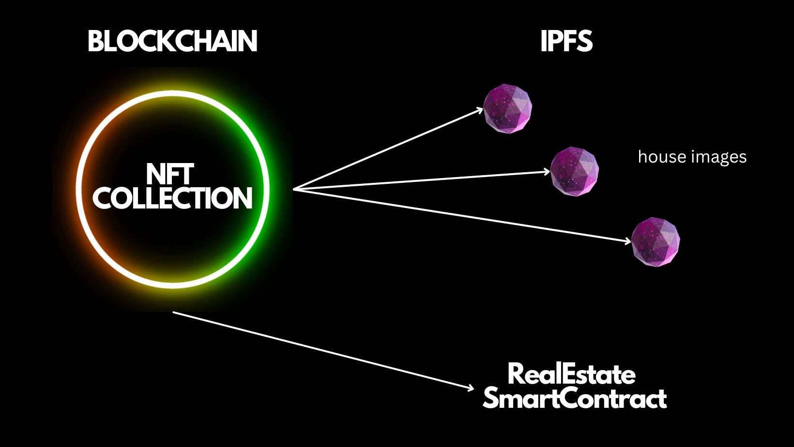
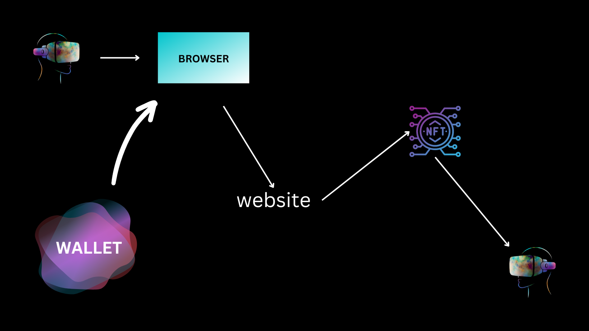

Real Estate Selling Dapp

Tech Stack:
Solidity
Hardhat
Ethersjs
React(i am not too good at this)

I was watching a blockchain introduction video, where he gave the example house buying system

1) We are going to create NFT of property that are to be listed.
Here, ERC721 standard are followed and openzepplin is being used.
Consider RealEstate Smartcontract for the same.

2) Here is the main dapp implementation

3) This currently focusses on selling the house. I am looking forward for more opton like renting out a property.
